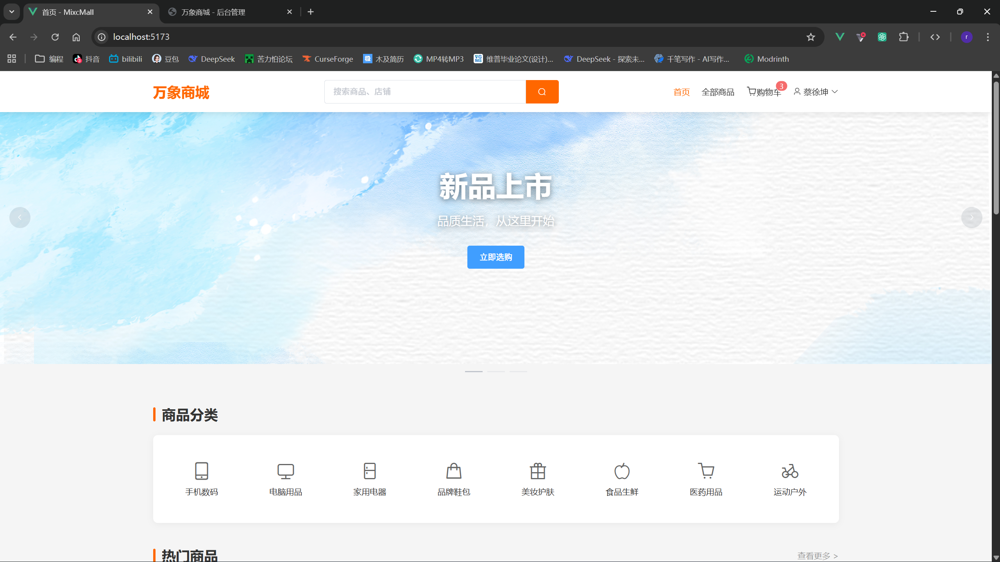
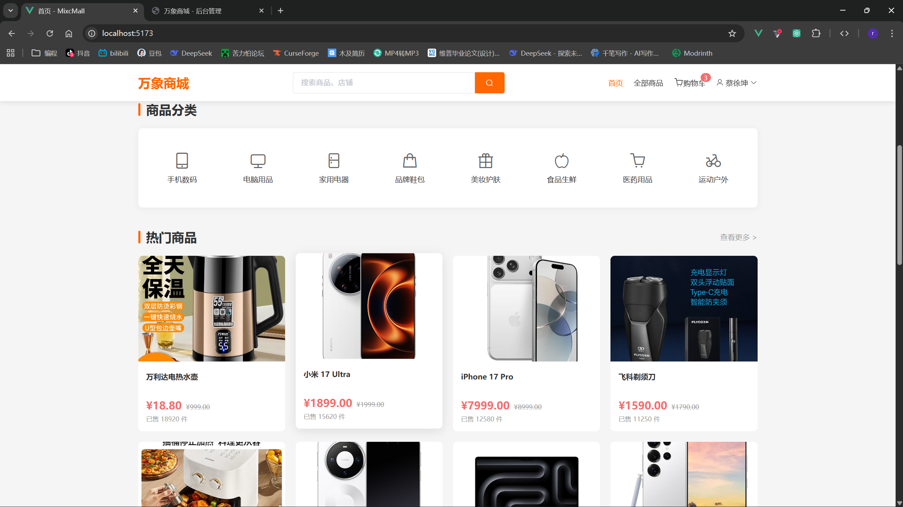
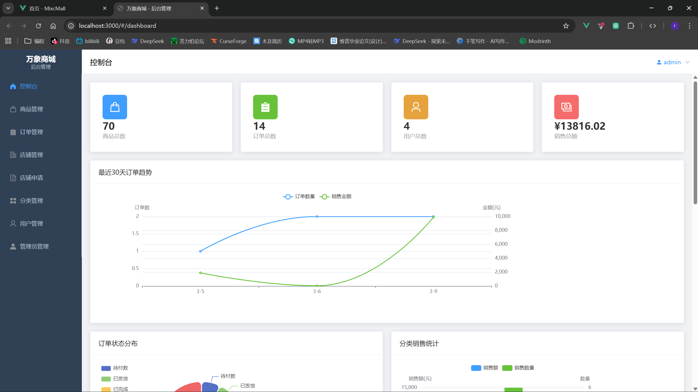

# 万象商城

一个功能完善的电商平台，包含前台商城、后台管理系统和后端API服务。








## 项目简介

万象商城是一个基于前后端分离架构的电商平台，支持多店铺管理、商品管理、订单管理、用户管理等核心功能。系统采用角色权限控制，区分超级管理员和普通管理员，实现精细化的权限管理。

## 技术栈

### 后端
- Node.js
- Express.js
- MySQL
- JWT (身份验证)
- Multer (文件上传)
- bcryptjs (密码加密)

### 前台商城
- Vue 2.7
- Vue Router
- Vuex
- Element UI
- Axios
- Vite

### 后台管理
- Vue 2.7
- Vue Router
- Element UI
- ECharts (数据可视化)
- Axios
- Vite

## 项目结构

```
MixcMall/
├── admin/              # 后台管理系统
│   ├── src/
│   │   ├── api/       # API接口
│   │   ├── components/# 组件
│   │   ├── router/    # 路由配置
│   │   └── views/     # 页面组件
│   └── package.json
├── frontend/          # 前台商城
│   ├── src/
│   │   ├── api/       # API接口
│   │   ├── components/# 组件
│   │   ├── router/    # 路由配置
│   │   ├── store/     # Vuex状态管理
│   │   └── views/     # 页面组件
│   └── package.json
├── server/            # 后端服务
│   ├── database/      # 数据库脚本
│   ├── src/
│   │   ├── config/    # 配置文件
│   │   ├── middleware/# 中间件
│   │   ├── routes/    # 路由
│   │   └── app.js     # 应用入口
│   ├── uploads/       # 上传文件存储
│   └── package.json
└── README.md
```

## 功能特性

### 前台商城
- 用户注册/登录
- 商品浏览和搜索
- 商品详情展示
- 购物车管理
- 订单创建和管理
- 地址管理
- 个人中心

### 后台管理
- **权限管理**
  - 超级管理员：拥有所有权限
  - 普通管理员：只能管理自己的店铺
- **商品管理**
  - 商品增删改查
  - 商品分类管理
  - 商品图片上传
  - 关联店铺
- **订单管理**
  - 订单列表查看
  - 订单状态更新
  - 订单详情查看
- **店铺管理**
  - 店铺信息管理
  - 店铺申请审核
  - 店铺关闭申请
- **用户管理**
  - 用户列表查看
  - 用户信息管理
- **数据统计**
  - 商品数量统计
  - 订单数量统计
  - 销售额统计
  - 数据可视化图表

## 项目截图

### 前台商城


### 后台管理


## 安装和运行

### 环境要求
- Node.js >= 14.x
- MySQL >= 5.7

### 数据库配置

1. 创建数据库：
```sql
CREATE DATABASE mixcmall CHARACTER SET utf8mb4 COLLATE utf8mb4_unicode_ci;
```

2. 执行初始化脚本：
```bash
cd server/database
mysql -u root -p mixcmall < init.sql
```

3. 执行店铺相关脚本：
```bash
mysql -u root -p mixcmall < create_shops.sql
mysql -u root -p mixcmall < create_shop_applications.sql
mysql -u root -p mixcmall < update_roles.sql
```

### 后端服务

1. 安装依赖：
```bash
cd server
npm install
```

2. 配置数据库连接：
编辑 `src/config/database.js`，修改数据库配置：
```javascript
module.exports = {
  host: 'localhost',
  user: 'root',
  password: 'your_password',
  database: 'mixcmall'
}
```

3. 启动服务：
```bash
npm start
# 或使用开发模式（自动重启）
npm run dev
```

后端服务运行在 `http://localhost:8081`

### 前台商城

1. 安装依赖：
```bash
cd frontend
npm install
```

2. 启动开发服务器：
```bash
npm run dev
```

前台商城运行在 `http://localhost:5173`

### 后台管理

1. 安装依赖：
```bash
cd admin
npm install
```

2. 启动开发服务器：
```bash
npm run dev
```

后台管理运行在 `http://localhost:5174`

## 默认账号

### 超级管理员
- 用户名：admin
- 密码：admin123
- 权限：所有功能

### 普通用户
- 需要自行注册

## API接口

### 用户相关
- POST `/api/user/register` - 用户注册
- POST `/api/user/login` - 用户登录
- GET `/api/user/info` - 获取用户信息

### 商品相关
- GET `/api/products` - 获取商品列表
- GET `/api/products/hot` - 获取热门商品
- GET `/api/products/new` - 获取新品
- GET `/api/products/:id` - 获取商品详情
- GET `/api/products/random` - 获取随机推荐商品

### 订单相关
- GET `/api/orders` - 获取订单列表
- GET `/api/orders/:id` - 获取订单详情
- POST `/api/orders` - 创建订单
- PUT `/api/orders/:id/cancel` - 取消订单
- POST `/api/orders/:id/pay` - 支付订单
- PUT `/api/orders/:id/confirm` - 确认收货

### 购物车相关
- GET `/api/cart` - 获取购物车
- POST `/api/cart` - 添加到购物车
- PUT `/api/cart/:id` - 更新购物车
- DELETE `/api/cart/:id` - 删除购物车商品

### 后台管理API
- POST `/api/admin/login` - 管理员登录
- GET `/api/admin/stats` - 获取统计数据
- GET `/api/admin/products` - 获取商品列表
- POST `/api/admin/products` - 添加商品
- PUT `/api/admin/products/:id` - 更新商品
- DELETE `/api/admin/products/:id` - 删除商品
- GET `/api/admin/orders` - 获取订单列表
- PUT `/api/admin/orders/:id/status` - 更新订单状态
- GET `/api/admin/users` - 获取用户列表
- GET `/api/admin/categories` - 获取分类列表
- GET `/api/admin/shops` - 获取店铺列表
- POST `/api/admin/shops` - 添加店铺
- PUT `/api/admin/shops/:id` - 更新店铺
- DELETE `/api/admin/shops/:id` - 删除店铺
- GET `/api/admin/shop-applications` - 获取店铺申请列表
- POST `/api/admin/shop-applications/:id/approve` - 审核通过
- POST `/api/admin/shop-applications/:id/reject` - 审核拒绝
- POST `/api/admin/shop-applications/:id/approve-close` - 审核通过关店
- POST `/api/admin/shop-applications/:id/reject-close` - 审核拒绝关店

## 权限说明

### 超级管理员
- 可以访问所有功能模块
- 可以管理所有店铺和商品
- 可以审核店铺申请
- 可以查看所有统计数据

### 普通管理员
- 只能访问控制台、商品管理、订单管理
- 只能管理自己创建的店铺
- 只能看到和操作自己店铺的商品和订单
- 只能看到自己店铺的统计数据
- 每个管理员只能创建一个店铺

## 注意事项

1. 确保MySQL服务已启动
2. 确保后端服务正常运行
3. 前端和后台的API地址配置在各自的 `src/api/request.js` 中
4. 上传的文件存储在 `server/uploads` 目录下
5. 建议使用开发模式运行，方便调试

## 开发说明

### 添加新功能
1. 后端：在 `server/src/routes/` 中添加新的路由
2. 前台：在 `frontend/src/api/` 中添加API调用
3. 后台：在 `admin/src/api/` 中添加API调用

### 数据库迁移
数据库脚本存放在 `server/database/` 目录，按需执行。

## 许可证

MIT
